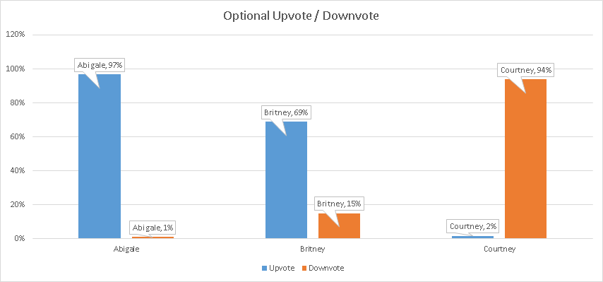
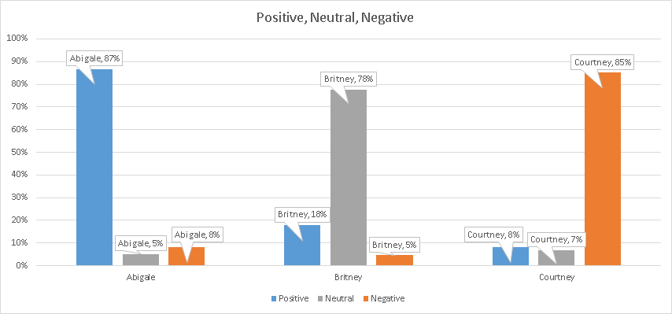
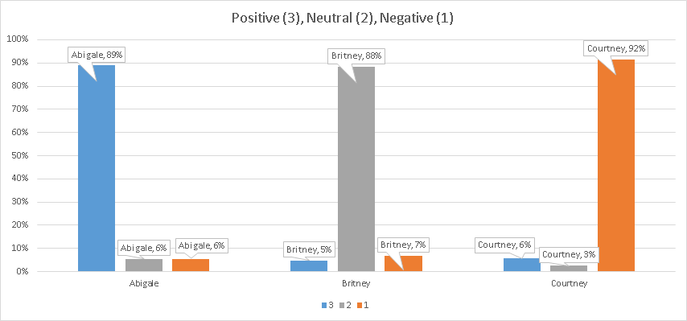
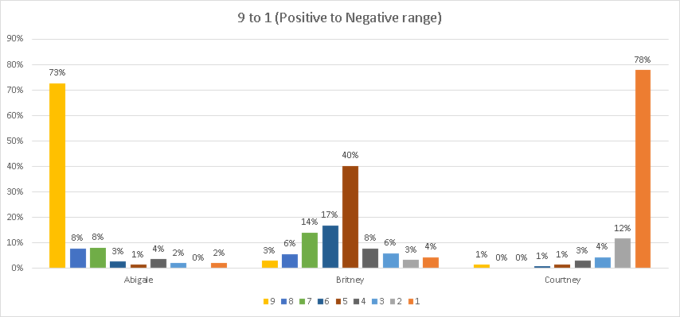
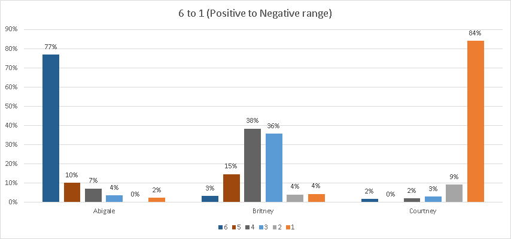

<link rel="stylesheet" href="/default.css">

# Rating Numeric Types

## Background

I've been experimenting on surveying people for some time, and have found an important occurance:

Even the slightest difference in the options available to answer a question, strongly effects how people will answer it.

I decided to run a survey that tested this effect directly.

## Survey

I ran [this survey](https://docs.google.com/forms/d/e/1FAIpQLSfuXRf0G4lg-CaS15Krn32HOQULCLvjwfNx-7GHWgvaQ7ToQw/viewform) to see how people make decisions.

There are three candidates: Abigale, Britney, and Courtney.

The survey instructs:

* Abigale is your Best Friend.
* Britney is an acquaintance. You feel neutrally about her.
* Courtney is bad. You hate her.

The idea is that you'd rate Abigale positively, Britney neutrally, and Courtney negatively.

Each of these candidates has an equal chance to win the vote.

The survey then asks how the user would vote, given varing rating options.

## Results

I collected 308 responses.

Let me start with the simplest situation:

### Upvotes and Downvotes
The user can either "Upvote" or "Downvote" any candidate. They can also choose not to vote.

Although the users were instructed that voting is optional, most of them voted for all candidates anyway. (98% answered for the positive candidate, 84% answered for the neutral candidate, 96% answered for the negative candidate).

This might have been for two reasons:

1. Although it's optional, asking someone a question may make them more likely to try to answer it anyway.
2. All of the other questions were not optional, which may have gotten the user to get used to try and answer all questions.

Despite being optional, the Positive candidate got the most amount of Positive votes, and the Negative candidate got the most amount of Negative votes, out of all other questions.

The most interesting result was with the Neutral candidate.

Subtracting the Positive and Negative vote, the Neutral candidate ends up with an overwhelming 54% Positive vote.

It seems people have difficulty understanding that a balanced "Neutral" vote, is still better than a "Downvote".

They end up voting the Neutral candidate positively, almost to spite the Negative candidate more.

### Voting Positive (+1), Neutral (0), Negative (-1)
This vote was very similar to the previous one, except that the "Neutral (0)" option was added, and the user had to answer the question. (it was no longer optional).

The requirement to make an answer, seems to have introduced noise to the positive and negative candidate answers. The "incorrect" answers for the positive and negative candidates rose to about 15% (up from only 2% in the optional Upvote/Downvote round.)

Here, the addition of a Neutral option significantly impacted the Neutral candidate's score to become overwhelmingly Neutral.

However, the higher Positive to Negative ratio continues to exist for the Neutral candidate.

The Neutral candidate ends up with a 13% positive score. A significant improvement over the previous 54% positive score.

Yet, users seem to have continued difficulty with the concept of choosing "0" or neutral.

For some reason, the Neutral candidate got only 78% percent of the Neutral vote. Compare to 87% and 85% for Positive and Negative candidates.

Perhaps things would change if we simply relabel "0" with something else?

### Voting 3, 2, 1
This voting system is exactly the same as the previous Positive, Neutral, and Negative vote, except that "+1" was renamed as "3", "0" was renamed to "2", and "-1" was renamed to "1".

The user is instructed: Bigger number is better. Smaller number is worse.

It sounds like simply renaming the votes to be a 3, 2, 1 model instead of +1, 0, -1 model, solved previous problems with the neutral candidate.

Now all three candidates have very similar maximums, all averaging at around 90%.

Changing Neutral to a "normal looking" number like 2, made the "neutral" candidate have a high neutral score. It also made the Neutral candidate's positive and negative votes about equal.

It sounds like my idea was right: People have difficulty assessing the value of 0 or Neutral, and prefer to have a scoring system that starts at 1.

Not only does the Neutral candidate have a normal looking score compared to the other candidates, but also the potential decreased abiguity has caused the Positive and Negative candidate's scores to go up slightly as well. There is reduced noise.

Based on this experience, it sounds like the best way rating system should involve this 3, 2, 1 rating system, and to probably make the rating optional.

### Voting 9..1
The next voting system was meant to see if increasing the number of options would hurt or help the signal to noise ratio of the rating.

I gave users the ability to vote on a longer scale. Instead of providing just three options, they were given nine.

As before, the user was instructed: Bigger number is better. Smaller number is worse.

Per this chart, it seems adding more options has definitely added more noise into the system.

Although users had clear information about which candidate they like, dislike, and remain neutral to, the variety of options made all answers turn into a bell curve distribution.

Varying users have varying opinions regarding what an "8 out of 9" means, for example, and would hence vote differently, even though they are given the same information.

Several additional noise problems occurred:

The "Neutral" candidate has the lowest amount of agreement, with the most central option only being chosen 40% of the time.

Additionally, on average the Neutral candidate got more Positive than Negative votes.

Adding up all the votes of the Neutral candidate gets us to a 27% positive rating.

This is the same problem that we've seen earlier with Upvotes and Downvotes, and is noise that we're trying to avoid.

Overall, this shows me that a 3,2,1 voting system is superior, as otherwise there are just too many options for users to choose.

### Voting 6..1
This last question is very similar to the 9..1 question, and was just meant to answer a small curiosity of mine:

How will people vote for the neutral candidate, if there is no absolute "middle" option.

As you can see in the chart, people mostely divided their neutral votes between the two central numbers 3 and 4.

However, the positive bias is visible for the neutral candidate. Adding up the candidate's score gives us a 15% positive score.

The noise, albeit smaller than in the 9..1 case, continues to be visible.

The 3,2,1 scoring system seems better than this 6..1 system for rating absolutes.
