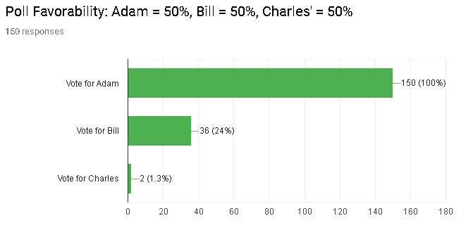
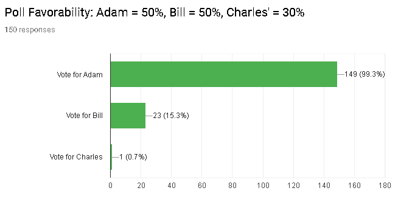
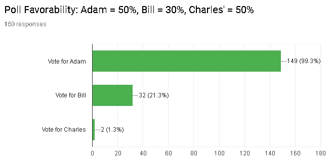
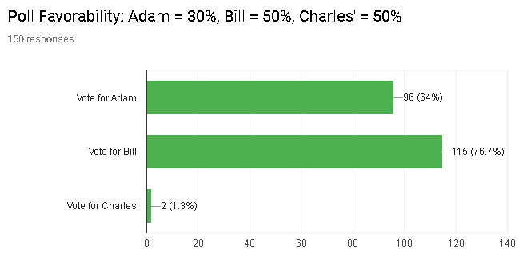

<link rel="stylesheet" href="/default.css">

# Approval Voting

## Background

[Approval Voting](https://en.wikipedia.org/wiki/Approval_voting) allows to vote for more than one candidate for an election.

The idea is that instead of just voting for your favorite person, you'd vote for everyone you'd approve of.

Potentially the most "approved", but not necessarily the most "favorited" person would win the election.
This may lead to more moderate candidates to win.

This all sounds good in theory, but I decided to test out how people make such decisions, assuming they know what the polls for each candidate look like.

## Survey

I ran [this survey](https://docs.google.com/forms/d/e/1FAIpQLSd3G3Aw66CqJ-nX0GhGTMk6jrlWgkW_HIWnlHWbdV9-i5A-nQ/viewform?usp=sf_link) to see how people answer when they vote.

There are three candidates: Adam, Bill, and Charles.

The survey instructs:

* You love Adam's plan
* Bill has an OK plan
* You hate Charles' plan

The idea is that you'd rate Adam positively, Bill neutrally, and Charles negatively.

It then goes through several different scenarios of you knowing what the favorability polls look like for each of these candidates, and asks, how you'd vote for each person.

## Results

I collected about 150 responses. The results were suprising.

Let me start with the simplest situation:

### Equal Favorability Rates

Because all candidates are equal, voting for *both* Adam and Bill, may increase the possibility that Bill would be chosen over Adam, hence there's an incentive to vote for Adam more frequently than Bill.

As seen in the stats, Adam gets 100% of the votes, while Bill gets only a fourth of all votes.. which is still substantial, considering that people have a neutral outlook towards Bill.

### Adam and Bill have higher Favorability Rates

Here the situation is very similar to the equal favorability rates, except that Charles is unlikely to win, and Adam and Bill are in direct competition with eachother.

As a result, people are less likely to vote for Bill.

Although Adam continued to have near 100% of the vote, only 15% of the people voted for Bill.

### Adam and Charles have higher Favorability Rates

Here is where things started to get suprising for me.

Bill is unlikely to win the vote.

Voting for Bill does not place him in direct competition against Adam.

Yet, people continue to vote for him in a similar way to when they were all equal.

It feels as if that 20% a "eh" kind of vote that any neutral candidate will get, as long as they are unlikely to win.

### Bill and Charles have higher Favorability Rates

Here is the most interesting result.

What happens if your favorite candidate has a low chance of winning? Will you still vote for him?

Per theory, the answer was supposed to be an overwhelming "yes".

Why not vote for your favorite? You've got nothing to lose!

But as you can see from the results, the votes tell a different story.

This has been the first time no candidate got near 100% of the votes.

Even though both candidates could have been voted on at the same time, the neutral candidate still got more votes than the favorable one.

In fact the favorable candidate only got 64% of the votes. The neutral candidate was not far behind at about 77% of the votes.

It is interesting how people make such decisions.

It feels as if people don't want to vote for the losing candidate, regardless if they favor him.

---

This survey was exciting. I intend to do more of these, testing out different forms of voting, and eventually provide a comparison of all of them.

Please feel free to fill out my [next survey](https://docs.google.com/forms/d/e/1FAIpQLSdEKCGuxMN1-2tGkLDmw4oe-5Q0jHCQ7hDnNcY7vbAkdKKWmQ/viewform), focused on [Score Voting](https://en.wikipedia.org/wiki/Score_voting).
