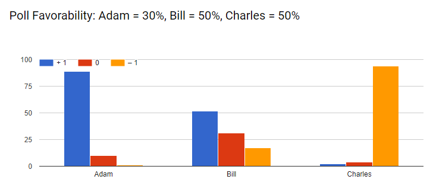

<link rel="stylesheet" href="/default.css">

# Score Voting

## Background

[Score Voting](https://en.wikipedia.org/wiki/Score_voting), also known as Range Voting, allows to write a score for each candidate in an election.

The "scores" can range from something like giving a number from 0 to 10, to simple "upvoting" and "downvoting" each candidate.

The scores are then tallied up. The person with the highest score wins.

Hence, you can "upvote" more than one candidate if you like both, and you can also "downvote" more than one candidate if you don't like both.

I decided to test out how people make such decisions, assuming they know what the polls for each candidate look like.

I used a similar scoring system to how Wikipedians vote on an issue: Positive (+1), Neutral (0), Negative (-1).

## Survey

I ran [this survey](https://docs.google.com/forms/d/e/1FAIpQLSdEKCGuxMN1-2tGkLDmw4oe-5Q0jHCQ7hDnNcY7vbAkdKKWmQ/viewform) to see how people answer when they vote.

There are three candidates: Adam, Bill, and Charles.

The survey instructs:

* You love Adam's plan
* Bill has an OK plan
* You hate Charles' plan

The idea is that you'd rate Adam positively, Bill neutrally, and Charles negatively.

It then goes through several different scenarios of you knowing what the favorability polls look like for each of these candidates, and asks, how you'd vote for each person.

## Results

I collected about 100 responses. The results were suprising.

Let me start with the simplest situation:

### Equal Favorability Rates

Adam clearly has a high positive score (96%),

Charles clearly has a high negative score (93%).

Bill, although getting the most neutral vote, it seems as if people had difficulty chosing it.

A little more than half (56%) of Bill's vote was neutral.

Bill's positive and negative scores were very close (20% and 24%).

I feel people have a harder grasp of Neutral, Zero, or Null, compared to Positive or Negative.

It sounds like if your going to do score rating, you might as well simply allow for optional Upvotes and Downvotes, like in Reddit or YouTube, rather than allowing for a third middle tier.

It would be interesting to see if people would have valued a rank system with "1,2,3" significantly differently than a system with "-1,0,1".

### Adam and Bill have higher Favorability Rates

Here the situation is very similar to the equal favorability rates, except that Charles is unlikely to win, and Adam and Bill are in direct competition with eachother.

Adam's vote had the highest vote here (97%).

Interestingly, Bill continues to get about half of the neutral vote (49%).

I presume people who voted highly for Adam, assumed there was nothing wrong with voting neutrally for Bill, hence the high neutral vote.

However, the direct competition caused Bill's negative vote came up close behind at 36%.

Bill's positive vote came down to only 15%.

The most surprising thing for me was Charles' decreased Negative vote.

I guess the thought went something like this:

> Charles is unlikely to win, so *I don't need to put too much effort into voting for him negatively*.

He instead got a few more neutral votes.

If you think about this deeply, it's a little counter-intuitive:

**Charles is polled to be less liked, and this causes people to not vote him as negatively.**

### Adam and Charles have higher Favorability Rates

Now the tables have turned. Bill is unlikely to win the vote.

Voting for Bill does not place him in direct competition against Adam.

Charles' negative vote is back to being higher than 90%.

Bill's neutral vote stays at 54%, similar to when they were all equal.

The main interesting portion here is bill's positive and negative votes.

Even though Bill is unlikely to win, people voted him less negatively (only 14%).

People further voted higher for Bill's positive vote at 32%.

I question why Bill gets more positive votes here. He is unlikely to win. It's as if people reasoned:

> I'm neutral about Bill, but I don't want Charles to win. Let me give Bill a positive vote, just to show him how much I don't like Charles.

### Bill and Charles have higher Favorability Rates

I've left the most interesting question for last:

What happens if your favorite candidate has a low chance of winning?

Here, Adam did get a slightly lower positive score, at only 89%. Here, his neutral score rose to 10%.

Charles' negative score remained high at 94%.

For the first time, Bill had a higher positive score at 52%. His neutral score was 31%.

Most interestingly, Bill's negative score remained at 17%. This was a higher negative score than when he had no chance of winning earlier!

I feel people have a dilemma when voting here.

On one hand, Adam the favorite, is unlikely to win. On the other hand, people don't want Charles to win.

But Bill isn't your favorite... I feel people vote negatively for Bill in protest that Adam *won't win*.

Since Adam got a slightly lower positive score here, were there any people that voted negatively for Adam that didn't positively vote for Bill?

I looked through all the individual votes, and the answer is a definite *no*:

This further shows, most people voted positively for both Adam and Bill.

---

This survey was exciting. I intend to do more of these, testing out different forms of voting, and eventually provide a comparison of all of them.

Please feel free to fill out my [next survey](https://docs.google.com/forms/d/e/1FAIpQLSdo6BFNdP61gRI2N1Cf-k7FhlRUPrnMFpxDJUAI8trjlxv7NA/viewform), focused on [Instant-runoff Voting](https://en.wikipedia.org/wiki/Instant-runoff_voting).
